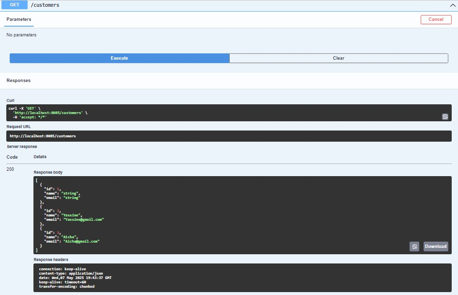

<h2>SQL database </h2>

<h2>Postman Get all customers</h2>

<h2>Postman Get  customer avec id=1</h2>

<h2>Postman Post  customer "ajout"</h2>

<h2>Postman Put  customer "update"</h2>

<h2>Postman Delete  customer avec id=4</h2>

<h2>Interface swagger</h2>

<h2>swagger Get all customers</h2>

<h2>swagger Get  customer avec id=2</h2>

<h2>swagger Post  customer "ajout" </h2>

<h2>swagger Put  customer "update" </h2>

<h2>swagger Delete  customer  </h2>

<h2>swagger Get all BankAccount</h2>

<h2>swagger Get all BankAccount avec le type de compte</h2>

<h2> Get all AccountOperation </h2>

<h2> Get all AccountOperation avec pagination </h2>

<h2> Partie frontend </h2>

<h2> Authentication</h2>

<h2> Customers list</h2>

<h2> Customer's  accounts</h2>

<h2> Customer search</h2>

<h2> Ajout de client</h2>

<h2> Suppression de client</h2>

<h2> Gestion du compte</h2>

<h2> Debit</h2>

<h2> Credit</h2>

<h2> Transfer</h2>

